# Mutual Fund Analytics Platform

**Capstone Project**

**Name:** Arunmozhi M

**Role:** Data Analyst Intern

**Organization:** Bluestock™

**Date:** July 2026

---

# Table of Contents

1. Introduction
2. Project Objectives
3. Dataset Description
4. Technology Stack
5. ETL Pipeline
6. SQLite Database
7. Exploratory Data Analysis (EDA)
8. Performance Analytics
9. Advanced Analytics
10. Power BI Dashboard
11. Results and Findings
12. Challenges Faced
13. Future Enhancements
14. Conclusion

---

# 1. Introduction

The Mutual Fund Analytics Platform is a comprehensive data analytics project developed to analyze Indian mutual fund data. The project combines data engineering, exploratory data analysis, financial performance metrics, and interactive business intelligence dashboards to provide meaningful insights into mutual fund performance and investor trends.

The workflow includes data extraction, cleaning, storage in SQLite, analytical computations using Python, and visualization using Power BI.

---

# 2. Project Objectives

- Build an automated ETL pipeline.
- Store cleaned data in SQLite.
- Perform exploratory data analysis.
- Calculate key mutual fund performance metrics.
- Develop an interactive Power BI dashboard.
- Apply advanced analytics for investment insights.
- Generate a professional analytical report.

---

# 3. Dataset Description

The project uses multiple datasets related to Indian mutual funds, including:

- Fund Master
- NAV History
- AUM by Fund House
- Scheme Performance
- SIP Monthly Data
- Category Inflows
- Investor Transactions
- Benchmark Indices
- Fund Scorecard

The raw datasets were cleaned and transformed into processed datasets for analysis.

---

# 4. Technology Stack

The project was developed using the following technologies:

| Technology | Purpose |
|------------|---------|
| Python | Data processing and analytics |
| Pandas | Data manipulation and cleaning |
| NumPy | Numerical computations |
| SQLite | Database storage |
| Jupyter Notebook | Analysis and experimentation |
| Power BI | Dashboard visualization |
| Git & GitHub | Version control |

---

# 5. ETL Pipeline

## Overview

The ETL (Extract, Transform, Load) pipeline was designed to automate the process of loading raw mutual fund datasets, cleaning them, and storing them for analysis.

## ETL Workflow

1. Extract raw CSV files.
2. Validate schema and data types.
3. Handle missing values.
4. Remove duplicate records.
5. Standardize column names.
6. Store cleaned data in SQLite database.
7. Export processed datasets for analysis.

## Key Data Cleaning Steps

- Missing values handled using appropriate imputation methods.
- Duplicate records removed.
- Date columns converted into datetime format.
- Numeric fields standardized.
- Inconsistent category labels corrected.

## ETL Output

The pipeline successfully generated cleaned datasets used for exploratory analysis, performance calculations, and dashboard development.

---

# 6. SQLite Database

## Database Design

SQLite was used as the central repository for storing cleaned mutual fund data.

## Main Tables

- fund_master
- nav_history
- scheme_performance
- fund_scorecard
- category_inflows
- investor_transactions
- benchmark_indices

## Benefits of Using SQLite

- Lightweight and portable.
- Easy integration with Python.
- Efficient querying for analytical workloads.
- Simplified project deployment.

## Example Queries

The database was used to:

- Retrieve fund performance metrics.
- Analyze NAV trends.
- Compare benchmark performance.
- Support dashboard visualizations.

---

---

# 7. Exploratory Data Analysis (EDA)

## Objective

The Exploratory Data Analysis (EDA) phase was conducted to understand the characteristics of the mutual fund datasets, identify trends, detect anomalies, and prepare the data for advanced financial analysis. Various statistical summaries and visualizations were created to derive meaningful insights.

---

## Data Quality Assessment

The following preprocessing steps were completed before analysis:

- Removed duplicate records.
- Handled missing values.
- Standardized column names.
- Converted date columns into datetime format.
- Corrected inconsistent data types.
- Verified data integrity before analysis.

---

## AUM Growth Analysis

The Assets Under Management (AUM) trend illustrates the overall growth of the mutual fund industry over time.

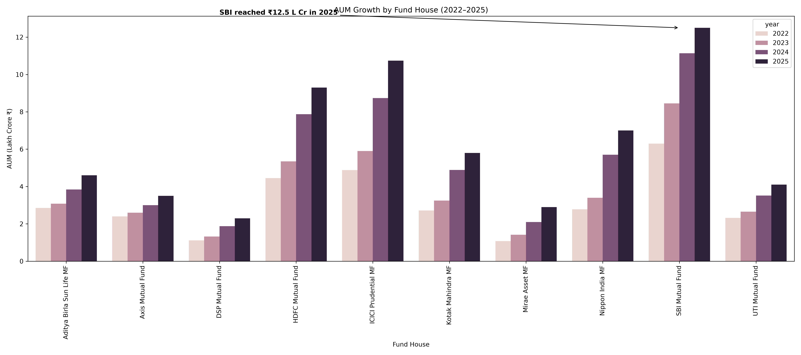

**Insight**

- AUM has shown consistent growth, indicating increasing investor confidence.

---

## Fund House Distribution

This chart compares the distribution of AUM across different fund houses.

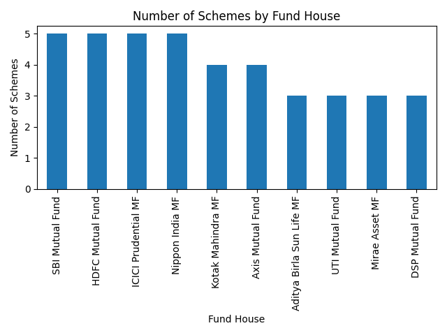

**Insight**

- A few major AMCs dominate the market with significantly higher AUM.

---

## Category Inflow Analysis

Category-wise inflows help identify investor preferences.

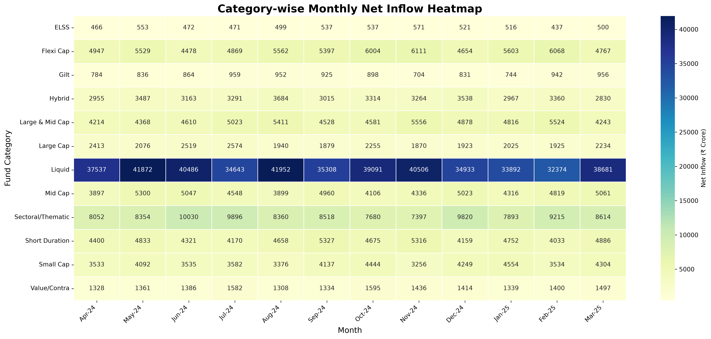

**Insight**

- Equity-oriented categories received higher inflows compared to debt-oriented categories.

---

## Benchmark Comparison

Benchmark performance was compared against mutual fund performance.

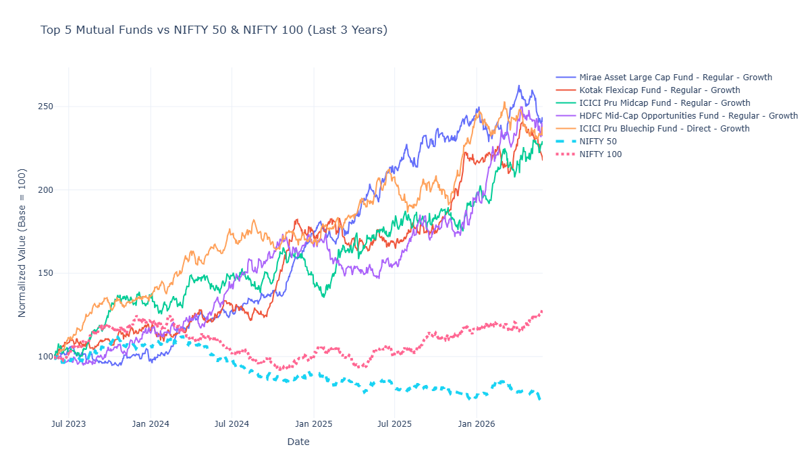

**Insight**

- Several funds outperformed benchmark indices over the analysis period.

---

## NAV Trend

Historical NAV values were analyzed to understand long-term fund performance.

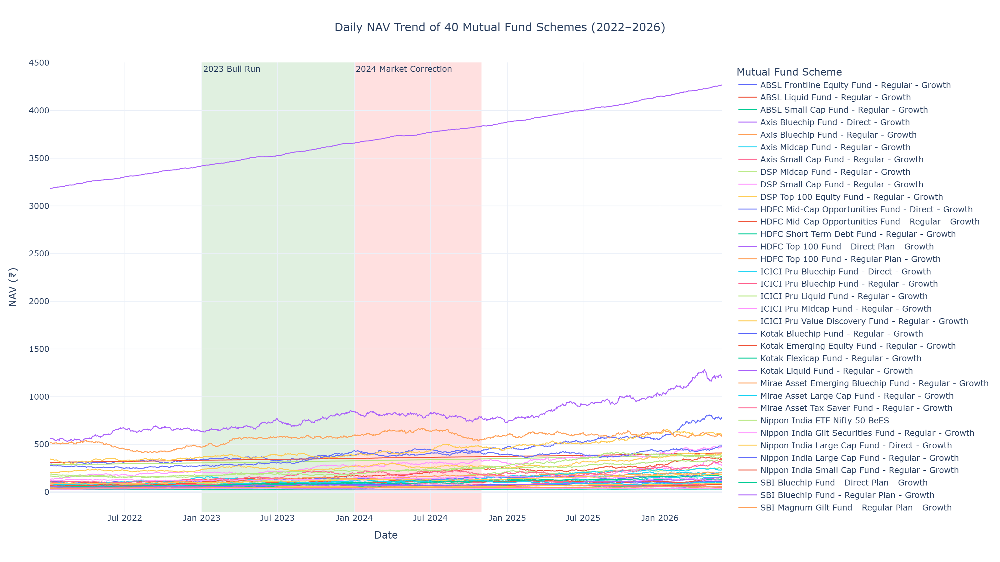

**Insight**

- NAV values demonstrated stable long-term growth with short-term fluctuations.

---

## Top Performing NAV Schemes

The following visualization shows the schemes with the highest latest NAV values.

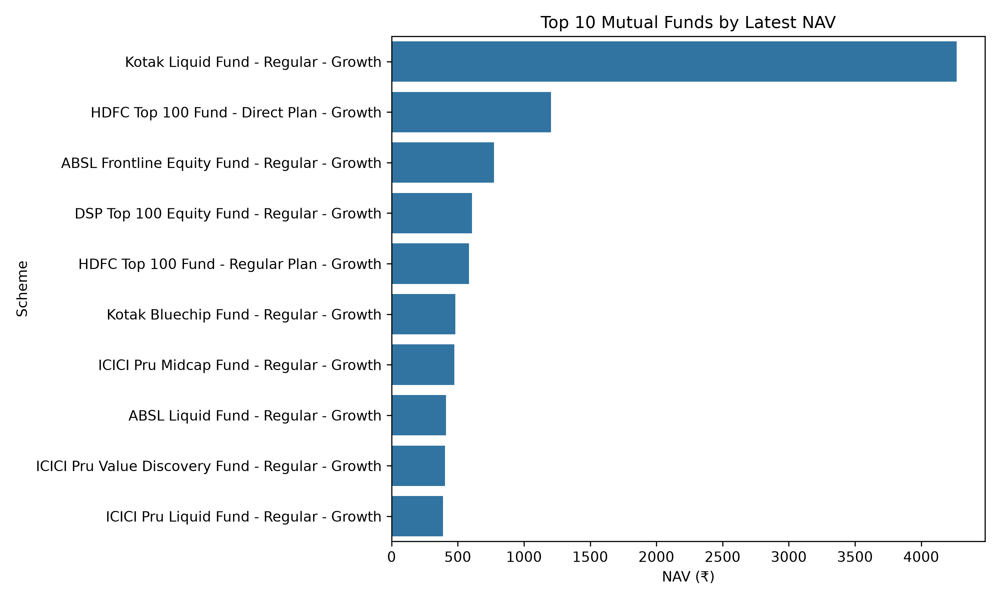

---

## Sector Allocation

Sector allocation analysis illustrates how investments are distributed across industries.

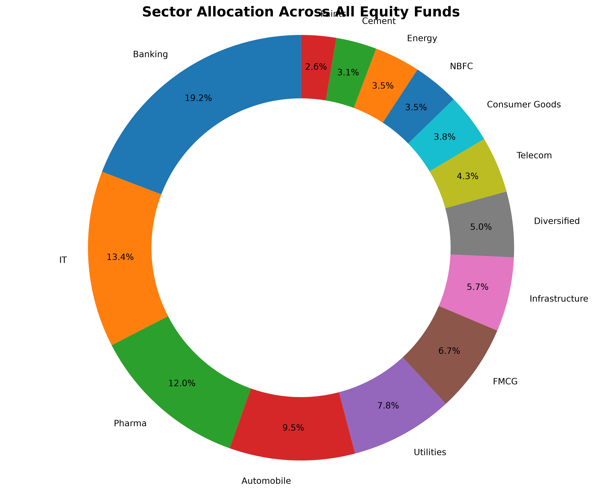

---

## Top Sector Weight

The chart below highlights the sectors with the highest allocation weight.

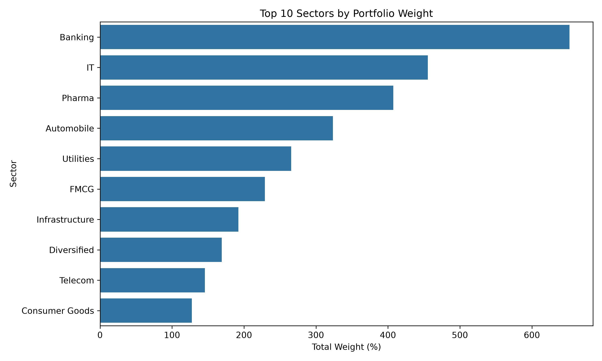

---

## Transaction Type Distribution

Investor transaction patterns were analyzed.

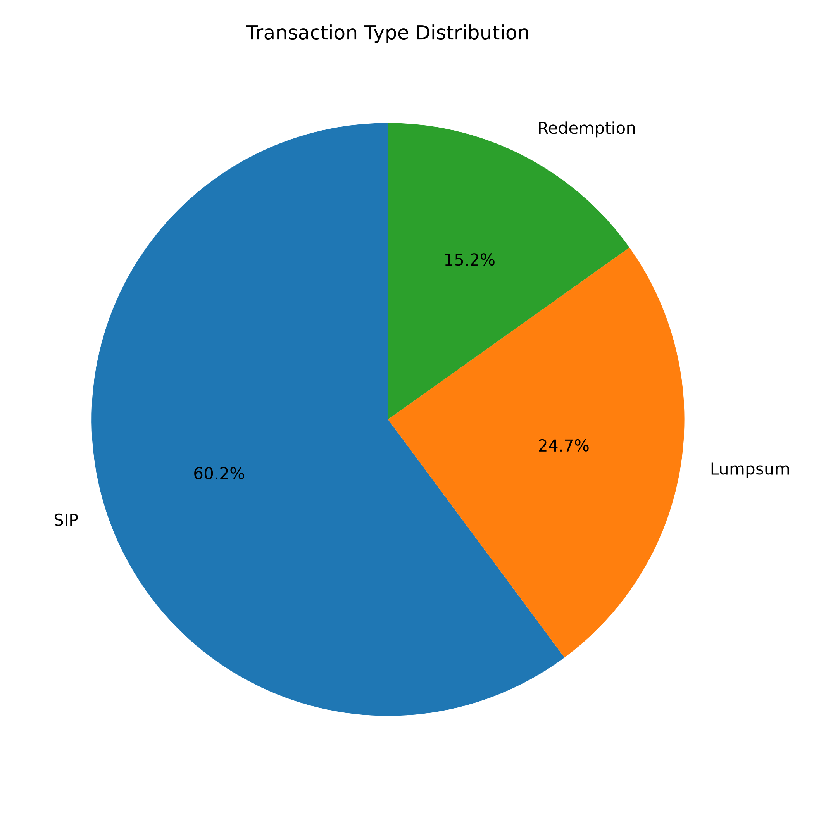

---

## Key Insights

- Assets Under Management increased steadily over time.
- Equity funds attracted the largest share of investments.
- Benchmark comparison highlighted strong-performing schemes.
- NAV trends reflected stable long-term growth.
- Sector allocation was diversified across major industries.
- Investor transactions indicated increasing participation in mutual funds.

---

# 8. Performance Analytics

## Overview

Performance analytics evaluates mutual funds using financial performance and risk-adjusted return metrics.

The following indicators were analyzed:

- CAGR
- Annualized Return
- Annualized Volatility
- Sharpe Ratio
- Sortino Ratio
- Alpha
- Beta
- Tracking Error
- Maximum Drawdown
- Value at Risk (VaR)

---

## Rolling Sharpe Ratio

Rolling Sharpe Ratio measures how risk-adjusted returns change over time.

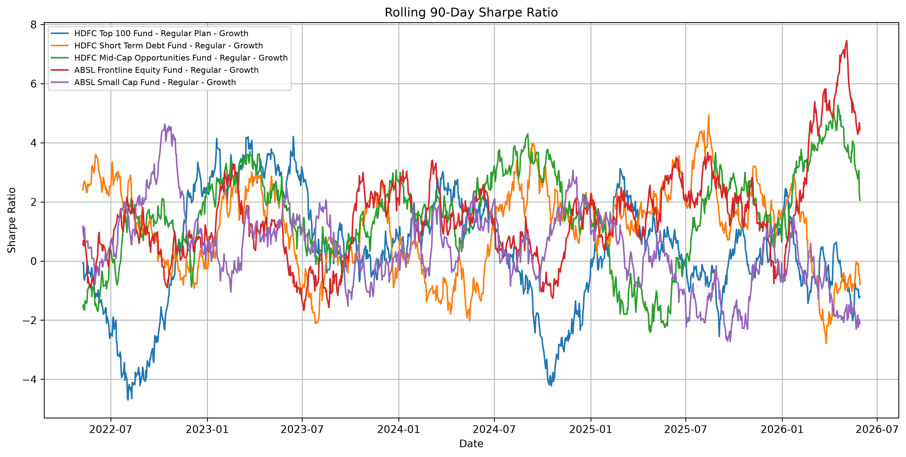

**Interpretation**

- Higher values indicate superior risk-adjusted performance.

---

## NAV Return Correlation

Correlation analysis measures relationships among fund returns.

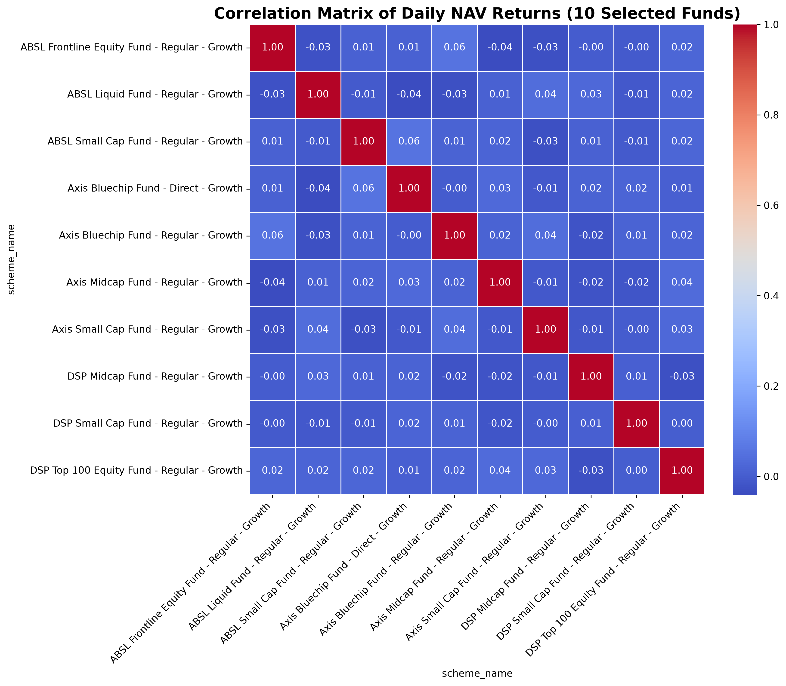

**Interpretation**

- Strong positive correlations indicate similar market behavior.

---

## SIP Amount by Age Group

Investment patterns were compared across different age groups.

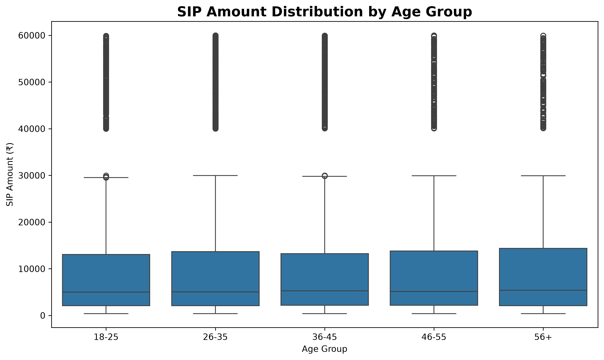

**Interpretation**

- Middle-aged investors contributed the highest SIP investments.

---

## State-wise SIP Investment

State-level SIP contributions were analyzed.

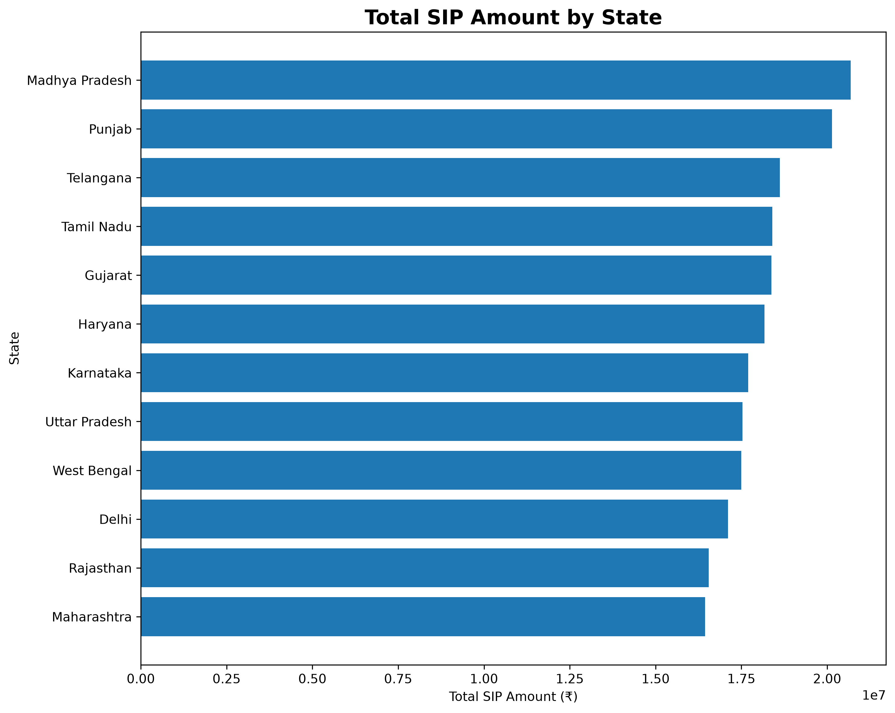

**Interpretation**

- Metropolitan regions showed significantly higher SIP investments.

---

## Summary

Performance analytics enabled comprehensive comparison of risk, return, and investment behaviour across mutual fund schemes.

---

# 9. Advanced Analytics

## Overview

Advanced analytics extends traditional financial analysis using investor behaviour, segmentation, and recommendation techniques.

---

## Investor Age Distribution

Investor participation was analyzed by age category.

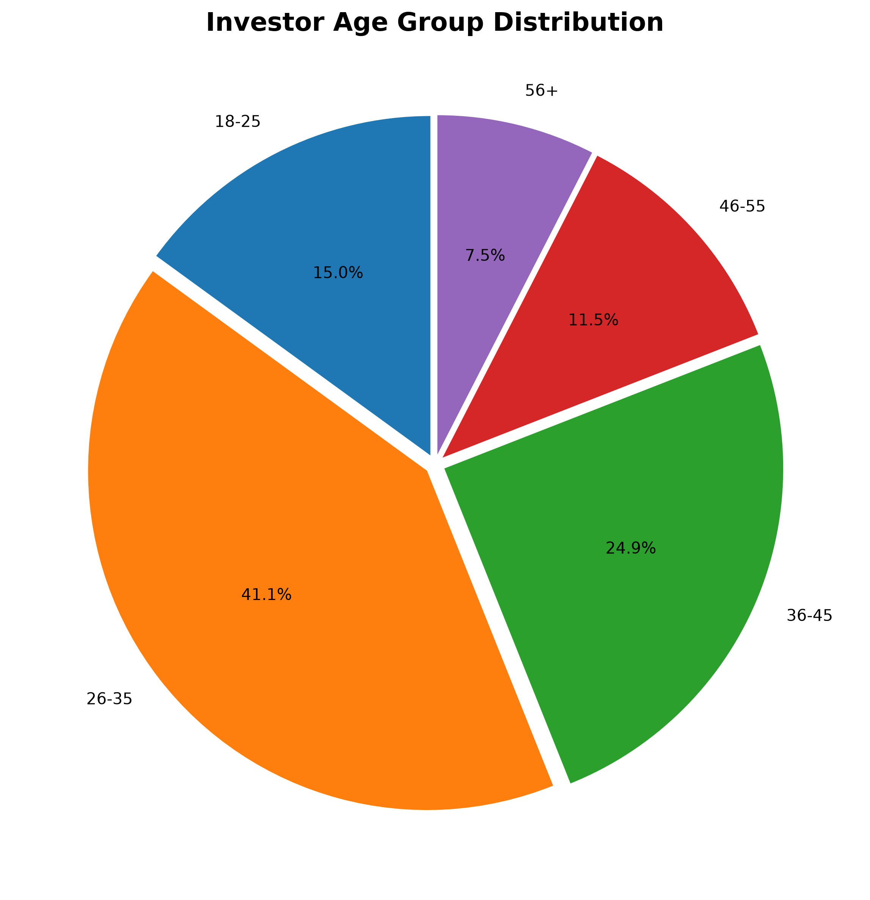

**Observation**

- Investors aged between 30 and 50 formed the largest investment group.

---

## Gender Distribution

The gender distribution provides additional investor demographic insights.

---

## SIP Distribution by Age Group

Monthly SIP contributions were analyzed across investor age groups.

---

## T30 vs B30 City Distribution

Investment behaviour was compared between Top-30 cities and Beyond-30 cities.

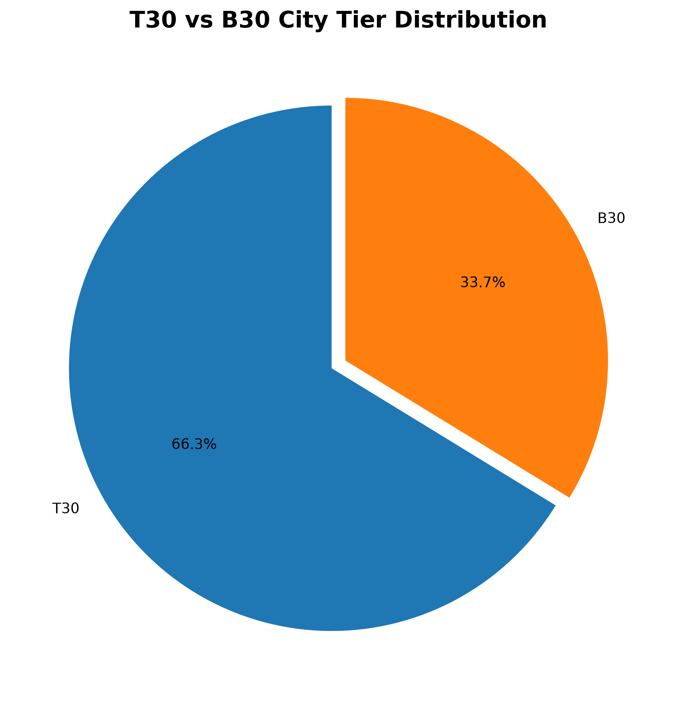

---

## Recommendation Analysis

Historical performance, investment behaviour, and analytical metrics were combined to support mutual fund recommendation logic.

### Recommendation Criteria

- Historical returns
- Risk-adjusted performance
- Volatility
- Fund category
- Investment trends

### Benefits

- Supports informed investment decisions.
- Simplifies fund comparison.
- Demonstrates practical application of data analytics in finance.

---

## Summary

Advanced analytics enhanced the project by combining traditional financial metrics with investor behaviour analysis and recommendation logic. These analyses provide meaningful decision support for mutual fund investors.

---

# 10. Power BI Dashboard

## Dashboard Overview

An interactive Power BI dashboard was developed to visualize mutual fund performance, investment trends, and risk metrics. The dashboard enables users to explore data dynamically using slicers and interactive visualizations.

## Dashboard Pages

### Page 1 – Industry Overview

This page presents a high-level overview of the Indian mutual fund industry.

**Visualizations Included**

- Total Assets Under Management (AUM)
- Monthly SIP Inflows
- Number of Schemes
- Number of Folios
- AUM Trend
- AUM by Fund House

> ## Dashboard Page 1

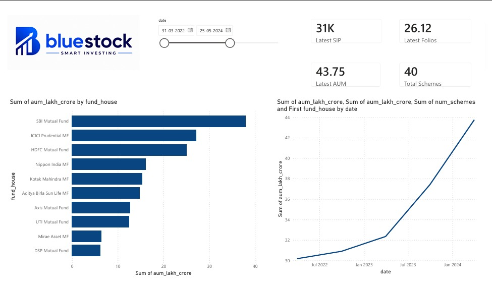

---

### Page 2 – Fund Performance

This page compares the performance of various mutual fund schemes.

**Visualizations Included**

- CAGR Comparison
- Fund Return Comparison
- Top Performing Schemes
- Category-wise Performance

>## Dashboard Page 2

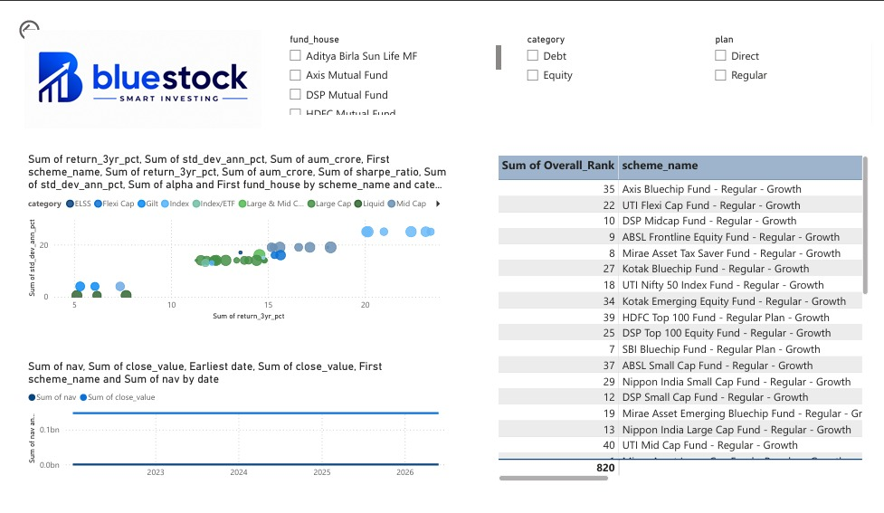
---

### Page 3 – Risk Analytics

This page focuses on financial risk indicators.

**Visualizations Included**

- Sharpe Ratio
- Sortino Ratio
- Alpha
- Beta
- Maximum Drawdown
- Tracking Error
- Value at Risk (VaR)

> ## Dashboard Page 3

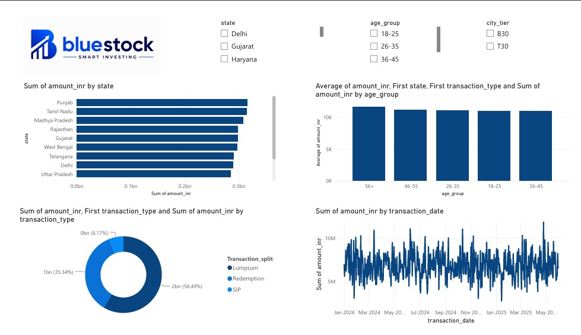

---

### Page 4 – Investor Insights

This page provides insights into investor behavior and investment trends.

**Visualizations Included**

- SIP Trends
- Investor Transactions
- Category Inflows
- Fund Recommendation Insights

>## Dashboard Page 4

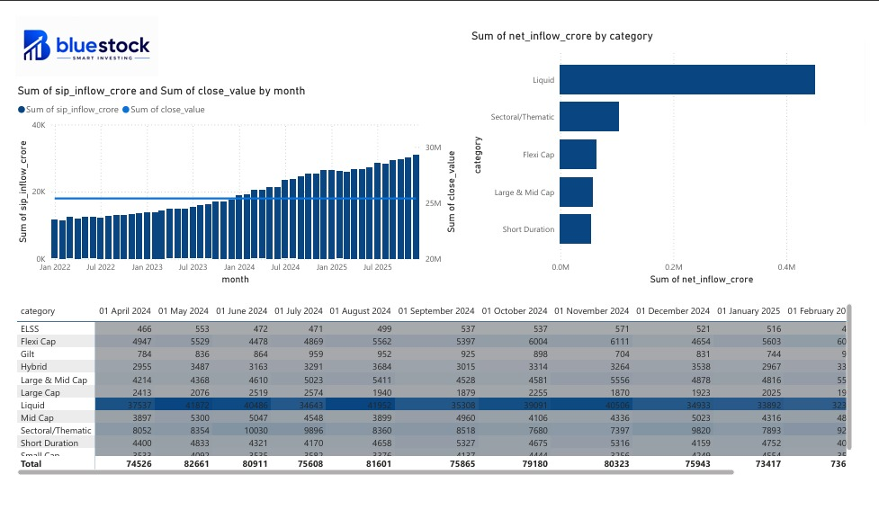

---

# 11. Results and Findings

The project successfully achieved all planned objectives.

## Major Outcomes

- Automated ETL pipeline developed.
- Cleaned and standardized multiple mutual fund datasets.
- Successfully stored processed data in SQLite.
- Conducted detailed Exploratory Data Analysis.
- Calculated key financial performance metrics.
- Built an interactive Power BI dashboard with four pages.
- Performed advanced analytics including Value at Risk and recommendation logic.

## Business Insights

- Equity funds demonstrated strong long-term growth.
- SIP investments showed a consistent upward trend.
- Risk-adjusted metrics helped identify balanced investment options.
- Dashboard enables faster investment analysis and comparison.

---

# 12. Challenges Faced

The following challenges were encountered during project development:

- Missing and inconsistent data.
- Handling multiple datasets with different formats.
- Cleaning date columns.
- Calculating financial metrics accurately.
- Integrating multiple datasets into a single dashboard.
- Optimizing notebook performance.

These challenges were addressed using structured preprocessing, validation, and efficient Python workflows.

---

# 13. Future Enhancements

The project can be extended through the following improvements:

- Live NAV data integration using APIs.
- Streamlit web application.
- Portfolio optimization using Markowitz Efficient Frontier.
- Monte Carlo simulation for investment forecasting.
- Automated email reporting.
- Cloud deployment for real-time analytics.

---

# 14. Conclusion

The Mutual Fund Analytics Platform demonstrates the complete lifecycle of a data analytics project, including data ingestion, preprocessing, database management, exploratory analysis, financial performance evaluation, advanced analytics, and business intelligence dashboard development.

The project showcases practical applications of Python, SQLite, and Power BI in solving real-world financial analytics problems and provides a scalable foundation for future enhancements.

---

# References

- AMFI India
- NSE India
- Mutual Fund India datasets
- Python Documentation
- Pandas Documentation
- NumPy Documentation
- SQLite Documentation
- Power BI Documentation